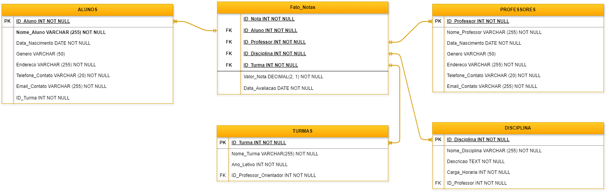

# MBA - Engenharia de Dados Mackenzie.
## Data Collection & Storage

Este repositório vai abrigar um projeto de modelagem de dados. Tarefa obrigatória para obtenção do grau de MBA em Data Engineer.

# Projeto 

Pense em uma empresa, desenhe as tabelas Relacionais e Multidimensionais

1. Pense no nome do Domínio de informação e da Sigla
2. Pense no modelo de negócio e crie os campos com nomes lógicos e físicos
3. Crie o Glossário de Dados
4. Desenhe as tabelas físicas e lógicas Relacionais com as (Chave _PK_ e campos)
5. Crie as tabelas Fato e Dimensão
6. Crie o Script SQL para criar a tabela FATO (_Extract_/_Data Collection_)

Para essa atividade pode ser utilizado o **Draw.io** para criar os desenhos das tabelas.

## Case


A empresa, o **_Colégio Godai de Ensino_**, pretende criar um banco de dados onde contenha os dados de seus alunos, professores, disciplinas dos alunos.
Deve ser também criada uma tabela fato para reunir as dimensões, apresentando as notas dos alunos.

## 1. Pense no nome do Domínio de Informação e da Sigla

**Domínio da Informação:** Educational
**Sigla:** EDU

## 2. Pense no modelo de negócio e crie os campos com nomes lógicos e físicos

### Alunos

| Lógico                      | Físico             | Chave |
|-----------------------------|--------------------|-------|
| Código do Aluno             | `ID_Aluno`         | PK    |
| Nome do Aluno               | `Nome_Aluno`       |       |
| Data de Nascimento do Aluno | `Data_Nascimento`  |       |
| Gênero do Aluno             | `Genero`           |       |
| Endereço do Aluno           | `Endereco`         |       |
| Telefone do Aluno           | `Telefone_Contato` |       |
| Email do Aluno              | `Email_Contato`    |       |

### Professores

| Lógico                          | Físico             | Chave |
|---------------------------------|--------------------|-------|
| Código do Professor             | `ID_Professor`     | PK    |
| Nome do Professor               | `Nome_Professor`   |       |
| Data de Nascimento do Professor | `Data_Nascimento`  |       |
| Gênero do Professor             | `Genero`           |       |
| Endereço do Professor           | `Endereco`         |       |
| Telefone do Professor           | `Telefone_Contato` |       |
| Email do Professor              | `Email_Contato`    |       |

### Disciplinas

| Lógico                  | Físico            | Chave |
|-------------------------|-------------------|-------|
| Código da Disciplina    | `ID_Disciplina`   | PK    |
| Nome da Disciplina      | `Nome_Disciplina` |       |
| Descrição da Disciplina | `Descricao`       |       |
| Carga Horária           | `Carga_Horaria`   |       |
| Código do Professor     | `Endereco`        | FK    |

### Turmas

| Lógico              | Físico                    | Chave |
|---------------------|---------------------------|-------|
| Código da Turma     | `ID_Turma`                | PK    |
| Nome da Turma       | `Nome_Turma`              |       |
| Ano Letivo          | `Ano_Letivo`              |       |
| Código do Professor | `ID_Professor_Orientador` | FK    |

## 3. Crie o Glossário de Dados

| Nome Físico             | Nome Lógico                    | Descrição                                                                       | Tipo         | Tabelas                                | Nullable |
|-------------------------|--------------------------------|---------------------------------------------------------------------------------|--------------|----------------------------------------|----------|
| ID_Aluno                | Código do Aluno                | Identificador único do aluno.                                                   | INT()        | Alunos / Fato_Notas                    | Não      |
| Nome_Aluno              | Nome do Aluno                  | Nome completo do aluno.                                                         | VARCHAR(255) | Alunos                                 | Não      |
| Data_Nascimento         | Data de Nascimento             | Data de nascimento do indivíduo identificado.                                   | DATE         | Alunos / Professores                   | Não      |
| Genero                  | Gênero                         | Gênero o qual o indivíduo se identifica.                                        | VARCHAR(50)  | Alunos / Professores                   | Sim      |
| Endereco                | Endereço                       | Endereço de residência do indivíduo.                                            | VARCHAR(255) | Alunos / Professores                   | Não      |
| Telefone_Contato        | Telefone                       | Telefone de contato do responsável legal.                                       | VARCHAR(20)  | Alunos / Professores                   | Não      |
| Email_Contato           | E-mail                         | E-mail de contato do responsável legal.                                         | VARCHAR(255) | Alunos / Professores                   | Não      |
| ID_Professor            | Código do Professor            | Identificador único do professor.                                               | INT()        | Professores / Disciplinas / Fato_Notas | Não      |
| Nome_Professor          | Nome do Professor              | Nome completo do professor.                                                     | VARCHAR(255) | Professores                            | Não      |
| ID_Disciplina           | Código da Disciplina           | Identificador único da disciplina.                                              | INT()        | Disciplinas / Fato_Notas               | Não      |
| Nome_Disciplina         | Nome da Disciplina             | Nome completo da disciplina.                                                    | VARCHAR(255) | Disciplinas                            | Não      |
| Descricao               | Descrição da Disciplina        | Breve descrição da disciplina.                                                  | TEXT         | Disciplinas                            | Não      |
| Carga_Horaria           | Carga Horária                  | Tempo, em horas, que o aluno terá da disciplina.                                | INT()        | Disciplinas                            | Não      |
| ID_Turma                | Código da Turma                | Identificador único da turma.                                                   | INT()        | Alunos / Turmas / Fato_Notas           | Não      |
| Nome_Turma              | Nome da Turma                  | Nome da Turma.                                                                  | VARCHAR(255) | Turmas                                 | Não      |
| Ano_Letivo              | Ano Letivo                     | Ano letivo das turmas.                                                          | INT()        | Turmas                                 | Não      |
| ID_Professor_Orientador | Código do Professor Orientador | Identificador único do professor orientador da turma (O mesmo do ID_Professor). | INT()        | Turmas                                 | Não      |
| ID_Nota                 | Código da Nota                 | Identificador único da nota.                                                    | INT()        | Fato_Notas                             | Não      |
| Nota                    | Nota                           | Valor da nota obtida pelo aluno, com uma casa decimal de precisão.              | DECIMAL(2,1) | Fato_Notas                             | Não      |
| Data_Avaliacao          | Data da Avaliação              | Data na qual a avaliação foi aplicada.                                          | DATE         | Fato_Notas                             | Não      |

## 4. Desenhe as tabelas físicas e lógicas Relacionais com as (Chave _PK_ e campos)


## 5. Crie as tabelas Fato e Dimensão

### Fato_Notas

| Lógico                   | Físico           | Chave |
|--------------------------|------------------|-------|
| Código da Nota           | `ID_Nota`        |       |
| Código do Aluno          | `ID_Aluno`       | FK    |
| Código do Professor      | `ID_Professor`   | FK    |
| Código da Disciplina     | `ID_Disciplina`  | FK    |
| Código da Turma          | `ID_Turma`       | FK    |
| Nota obtida pelo aluno   | `Valor_Nota`     |       |
| Data da prova da matéria | `Data_Avaliacao` |       |



## 6. Crie o Script SQL para criar a tabela FATO (_Extract_/_Data Collection_)

Todo o código SQL pode ser visualizado baixando o arquivo disponibilizado no link:

[!](https://github.com/matheusvieger/Data_Collection_Storage/blob/main/Código_SQL_Modelagem.db)

Recomendo o uso do SQLonline para essa consulta, um SGBD gratuito:

[](https://sqliteonline.com/)

SQL Fato_Notas Schema:
```
CREATE TABLE Fato_Notas (
    ID_Nota INT NOT NULL,
    ID_Aluno INT NOT NULL,   
    ID_Professor INT NOT NULL,    
    ID_Disciplina INT NOT NULL,
    ID_Turma INT NOT NULL,
    Valor_Nota DECIMAL(2, 1) NOT NULL,
    Data_Avaliacao DATE NOT NULL,
    FOREIGN KEY (ID_Aluno) REFERENCES Alunos(ID_Aluno),
    FOREIGN KEY (ID_Professor) REFERENCES Professores(ID_Professor),
    FOREIGN KEY (ID_Disciplina) REFERENCES Disciplinas(ID_Disciplina),
    FOREIGN KEY (ID_Turma) REFERENCES Turmas(ID_Turma)
)
```
