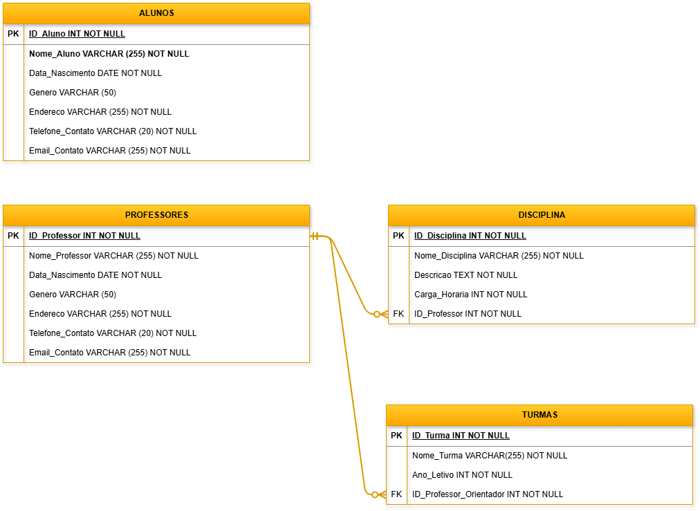

# MBA - Engenharia de Dados Mackenzie.
## Data Collection & Storage

Este repositório vai abrigar um projeto de modelagem de dados. Tarefa obrigatória para obtenção do grau de MBA em Data Engineer.

# Projeto 

Pense em uma empresa, desenhe as tabelas Relacionais e Multidimensionais

1. Pense no nome do Domínio de informação e da Sigla
2. Pense no modelo de negócio e crie os campos com nomes lógicos e físicos
3. Crie o Glossário de Dados
4. Desenhe as tabelas físicas e lógicas Relacionais com as (Chave _PK_ e campos)
5. Crie as tabelas Fato e Dimensão
6. Crie o Script SQL para criar a tabela FATO (_Extract_/_Data Collection_)

Para essa atividade pode ser utilizado o **Draw.io** para criar os desenhos das tabelas.

## Case

A empresa, o **_Colégio Godai de Ensino_**, pretende criar um banco de dados onde contenha os dados de seus alunos, professores, disciplinas e notas dos alunos.
Deve ser também criada uma tabela fato para reunir as dimensões.

## 1. Pense no nome do Domínio de Informação e da Sigla

**Domínio da Informação:** Educational
**Sigla:** EDU

## 2. Pense no modelo de negócio e crie os campos com nomes lógicos e físicos

### Alunos

| Lógico                      | Físico             | Chave |
|-----------------------------|--------------------|-------|
| Código do Aluno             | `ID_Aluno`         | PK    |
| Nome do Aluno               | `Nome_Aluno`       |       |
| Data de Nascimento do Aluno | `Data_Nascimento`  |       |
| Gênero do Aluno             | `Genero`           |       |
| Endereço do Aluno           | `Endereco`         |       |
| Telefone do Aluno           | `Telefone_Contato` |       |
| Email do Aluno              | `Email_Contato`    |       |

### Professores

| Lógico                          | Físico             | Chave |
|---------------------------------|--------------------|-------|
| Código do Professor             | `ID_Professor`     | PK    |
| Nome do Professor               | `Nome_Professor`   |       |
| Data de Nascimento do Professor | `Data_Nascimento`  |       |
| Gênero do Professor             | `Genero`           |       |
| Endereço do Professor           | `Endereco`         |       |
| Telefone do Professor           | `Telefone_Contato` |       |
| Email do Professor              | `Email_Contato`    |       |

### Disciplinas

| Lógico                  | Físico            | Chave |
|-------------------------|-------------------|-------|
| Código da Disciplina    | `ID_Disciplina`   | PK    |
| Nome da Disciplina      | `Nome_Disciplina` |       |
| Descrição da Disciplina | `Descricao`       |       |
| Carga Horária           | `Carga_Horaria`   |       |
| Código do Professor     | `Endereco`        | FK    |

### Turmas

| Lógico              | Físico                    | Chave |
|---------------------|---------------------------|-------|
| Código da Turma     | `ID_Turma`                | PK    |
| Nome da Turma       | `Nome_Turma`              |       |
| Ano Letivo          | `Ano_Letivo`              |       |
| Código do Professor | `ID_Professor_Orientador` | FK    |

## 3. Crie o Glossário de Dados

### Alunos

| Campo            | Descrição                                 |
|------------------|-------------------------------------------|
| ID_Aluno         | Identificador único do aluno.             |
| Nome_Aluno       | Nome completo do aluno.                   |
| Data_Nascimento  | Data de nascimento do aluno.              |
| Genero           | Gênero o qual o aluno se identifica.      |
| Endereço         | Endereço de residência do aluno.          |
| Telefone_Contato | Telefone de contato do responsável legal. |
| Email_Contato    | E-mail de contato do responsável legal.   |

### Professores

| Campo            | Descrição                                |
|------------------|------------------------------------------|
| ID_Professor     | Identificador único do professor.        |
| Nome_Professor   | Nome completo do professor.              |
| Data_Nascimento  | Data de nascimento do professor.         |
| Genero           | Gênero o qual o professor se identifica. |
| Endereço         | Endereço de residência do professor.     |
| Telefone_Contato | Telefone de contato do professor.        |
| Email_Contato    | E-mail de contato do professor.          |

### Disciplinas

| Campo           | Descrição                                                  |
|-----------------|------------------------------------------------------------|
| ID_Disciplina   | Identificador único da disciplina.                         |
| Nome_Disciplina | Nome completo da disciplina.                               |
| Descricao       | Breve descrição da disciplina.                             |
| Carga Horária   | Tempo, em horas, que o aluno terá da disciplina.           |
| ID_Professor    | Identificador único do professor que leciona a disciplina. |

### Turmas

| Campo                   | Descrição                                             |
|-------------------------|-------------------------------------------------------|
| ID_Turma                | Identificador único da turma.                         |
| Nome_Turma              | Nome da Turma.                                        |
| Ano_Letivo              | Ano letivo das turmas.                                |
| ID_Professor_Orientador | Identificador único do professor orientador da turma. |

## 4. Desenhe as tabelas físicas e lógicas Relacionais com as (Chave _PK_ e campos)

## 5. Crie as tabelas Fato e Dimensão

### Fato_Notas

| Lógico                   | Físico           | Chave |
|--------------------------|------------------|-------|
| Código da Nota           | `ID_Nota`        | PK    |
| Código do Aluno          | `ID_Aluno`       | PK,FK |
| Código do Professor      | `ID_Professor`   | PK,FK |
| Código da Disciplina     | `ID_Disciplina`  | PK,FK |
| Código da Turma          | `ID_Turma`       | PK,FK |
| Nota obtida pelo aluno   | `Valor_Nota`     |       |
| Data da prova da matéria | `Data_Avaliacao` |       |

| Campo          | Descrição                                                          |
|----------------|--------------------------------------------------------------------|
| ID_Nota        | Identificador único da nota.                                       |
| ID_Aluno       | Identificador único do aluno detentor da nota.                     |
| ID_Professor   | Identificador único do aluno detentor da matéria.                  | 
| ID_Disciplina  | Identificador único da disciplina na qual o aluno obteve a nota.   |
| ID_Turma       | Identificador único da turma do aluno.                             |  
| Nota           | Valor da nota obtida pelo aluno, com uma casa decimal de precisão. |
| Data_Avaliacao | Data na qual a avaliação foi aplicada.                             |

## 6. Crie o Script SQL para criar a tabela FATO (_Extract_/_Data Collection_)

Todo o código SQL pode ser visualizado baixando o arquivo disponibilizado no link:

Recomendo o uso do SQLonline para essa consulta, um SGBD gratuito:

